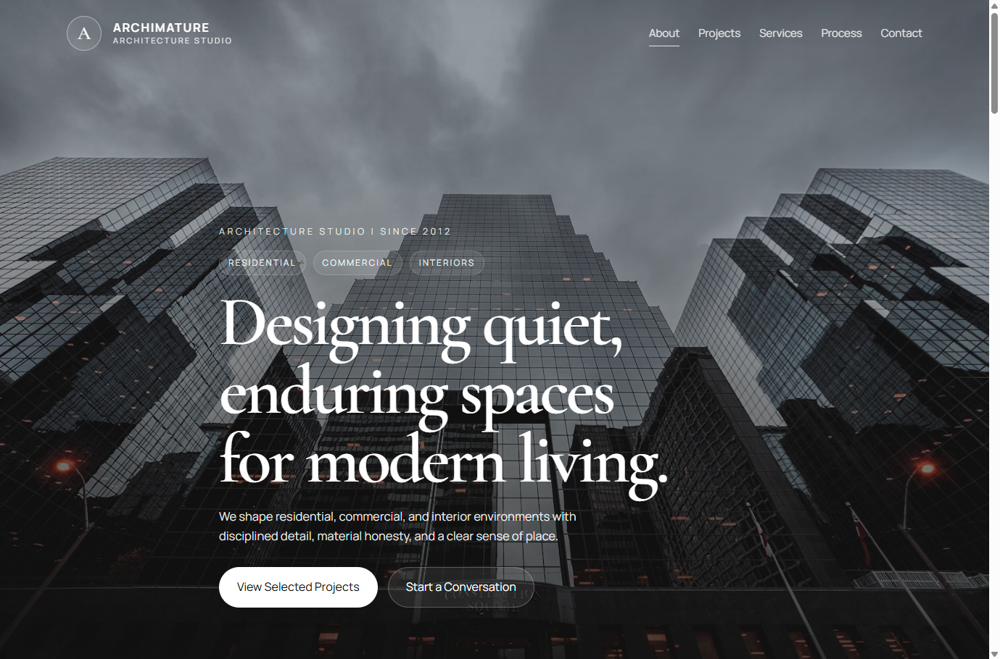
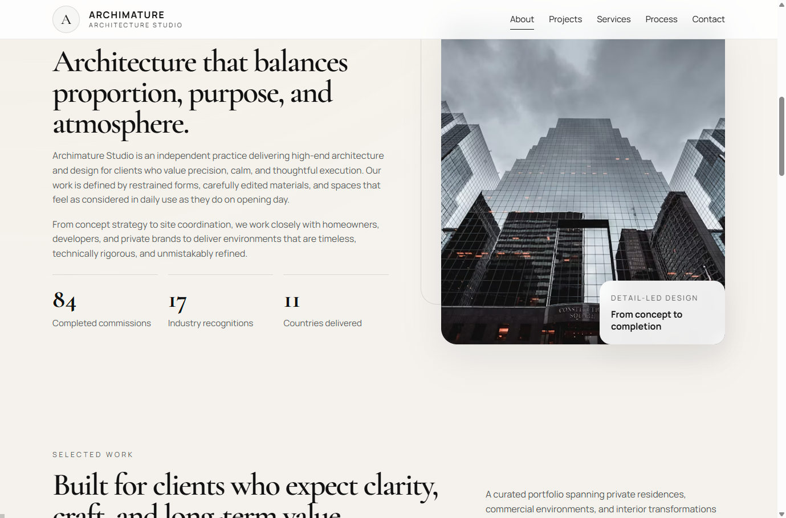

# Archimature — Architecture Studio Website

A premium architecture studio website built with **HTML, CSS, and JavaScript**, focused on clean design, strong typography, and a realistic business presentation.

---

## 🖼 Preview

---

## ✨ Features

- Editorial hero section
- Filterable project portfolio
- Services & process sections
- Smooth scroll animations
- Responsive design (mobile-first)
- Clean, minimal luxury UI

---

## 🛠 Tech Stack

- HTML5
- CSS3
- JavaScript (Vanilla)

---

## 📁 Project Structure

archimature/
├── assets/
├── index.html
├── styles.css
├── script.js
├── preview1.png
├── preview2.png
└── README.md

## 🌐 Live Demo

👉 https://your-vercel-link.vercel.app

---

## 🎯 Purpose

This project was built to demonstrate:

- premium UI/UX design
- business-ready website structure
- clean and professional frontend development

---

## 👨‍💻 Author

**Korab Ahmeti**  
Frontend Developer  
Founder @ PicartWeb

GitHub: https://github.com/PicartWeb

---

## 📜 License

MIT License — free to use and modify.
